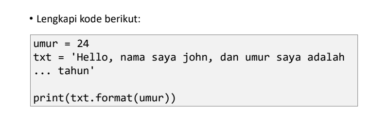

# praktikum12-pertemuan14

## Tugas pertemuan ke 14 Bahasa Pemrograman
## Nama : Andi setyawan
## NIM : 312210724
## Kelas : TI.22.C.9
## Prodi : Teknik Informatika

### Python String

* String adalah jenis yang paling populer di Python.
* Untuk membuatnya hanya dengan melampirkan karakter dalam tanda kutip.
* Python memperlakukan tanda kutip tunggal (' ') sama dengan  tanda kutip ganda (" ").
* Membuat string semudah memberi nilai pada sebuah variabel.

### Latihan 1

#### Penjelasan Latihan 1

* Untuk menghitung jumlah karakter, gunakan fungsi len().

* Cara mengambil satu karakter pada string yaitu dengan menggunakan kurung siku [ ] dan deklarasi nomor di dalam kurung siku dengan urutan ARRAY dan menggunakan titik dua lalu masukan nomor ARRAY selanjutnya. Untuk mengambil karakter terakhir, gunakan index [-1]. Sedangkan untuk mengambil karakter index ke-2 sampai ke-4, gunakan index [2:5].

* Jika ingin menghilangkan spasi pada string, gunakan method replace(). Method replace() mengganti semua kemunculan string lama dengan yang baru atau paling banyak kemunculan.

* Di dalam method replace, kita dapat menggunakan 2 cara, yang pertama bisa menggunakan (txt.replace(" ", "")) dan kedua dengan cara (txt.replace(txt[5], "")).

* Untuk mengubah huruf menjadi besar, gunakan method upper(). Sedangkan jika ingin mengubah huruf menjadi kecil, gunakan method lower().

* Untuk mengganti karakter 'H' dengan karakter 'J', gunakan method replace().

### Output Latihan 1

## Latihan 2

### Penjelasan Latihan 2

Untuk memasukkan variable ke dalam string, tambahkan kurung kurawal {} untuk menempatkan variable sebelumnya.

### Output Latihan 2

# TERIMA KASIH :)